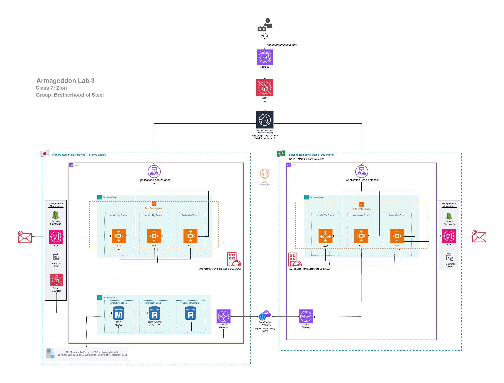
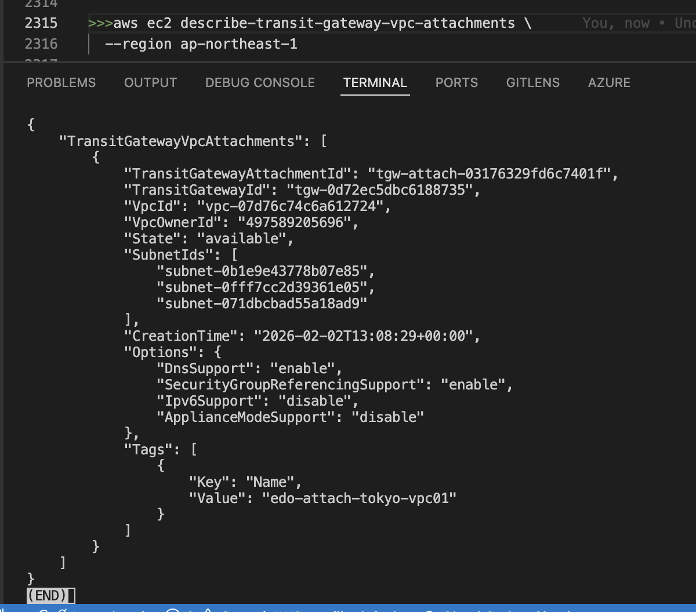
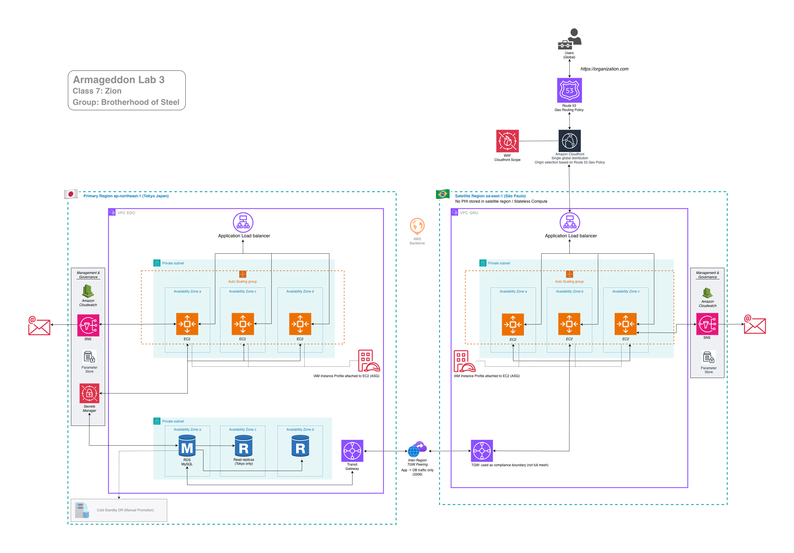

# [Lab 3a](https://github.com/DennistonShaw/armageddon/tree/main/SEIR_Foundations/Lab3)

sclab3

Lab 3 — Japan Medical Cross-Region Architecture with Legal Data Residency (APPI Compliance) Scenario Overview A Japanese medical organization operates: A primary medical data system in Tokyo A satellite medical office in São Paulo A single global application URL: chewbacca-growls.com Global access via CloudFront Strict legal requirement: All Japanese patient medical data (PHI) must remain physically stored in Japan

## Interview Talk Track (Memorize This)
  I designed a cross-region medical system where all PHI remained in Japan to comply with APPI. Tokyo hosted the database, São Paulo ran stateless compute, and Transit Gateway provided a controlled data corridor. CloudFront delivered a single global URL without violating data residency.

----

# JAPAN

### Project Infrastructure (Tokyo, Japan)
**VPC name  ==** edo_vpc01 (#relace bos with edo)
  - significance of the name edo. The Edo period (1603–1868) was critical in Japanese healthcare, marking a transition from exclusive reliance on Chinese medicine to the incorporation of Western knowledge via Rangaku (Dutch studies) and the strengthening of traditional Kampo. It established foundational medical education, a culture of public health, and a "use first, pay later" medicine system (okigusuri) that modernized access to healthcare. 

**Region =** ap-northeast-1  
**Availability Zone:** ap-northeaset-1a, ap-northeaset-1c, ap-northeaset-1d  
**CIDR ==** 10.81.0.0/16 

|Subnets|az zone a|az zone c|az zone d|
|---|---|---|---|
|**Public**|10.81.1.0/24|10.81.2.0/24|10.81.3.0/24 
|**Private**|10.81.101.0/24| 10.81.102.0/24|10.81.103.0/24
---

# BRAZIL

### Project Infrastructure (São Paulo, Brazil)
**VPC name  ==** gru_vpc01 (#relace bos with gru)

  - significance of the name gru. It is the IATA code for the international airport in São Paulo. GRU (São Paulo/Guarulhos–Governador André Franco Montoro International Airport).

**Region =** sa-east-1  
**Availability Zone:** sa-east-1a, sa-east-1b, sa-east-1c  
**CIDR ==** 10.55.0.0/16 

|Subnets|az zone a|az zone b|az zone c|
|---|---|---|---|
|**Public**|10.55.1.0/24|10.55.2.0/24|10.55.3.0/24 
|**Private**|10.55.101.0/24| 10.55.102.0/24|10.55.103.0/24

------
------

# meeting #10 - my-armageddon-project-1
### Group Leader: Omar Fleming
### Team Leader: Larry Harris
### Date: 01-27-26 (Tuesday)
### Time: 8:00pm - 8:30pm est. in class
### Time: 8:300pm -  pm est. with group

---------

### Members present: 
- Larry Harris
- Dennis Shaw
- LT (Logan T)
- David McKenzie
- Ted Clayton
- Tre Bradshaw

--------

## In group meeting
- working on lab3
- discussing whether we should add resources for failover?
  -  3 availability zones
  -  2 regions?
  - research failover system

What AWS recommends instead for RDS (healthcare-safe)

For a Japanese healthcare system (PHI, strict availability, data residency), the gold-standard options are using these 2 in tandem:

1. RDS Multi-AZ (mandatory baseline)
   - Synchronous replication
   - Automatic failover
   - Zero data loss (RPO ≈ 0)
   - Region-bound (Tokyo → Tokyo)
   - (This is non-negotiable for healthcare)

1. Cross-Region Read Replica (Tokyo → Osaka or backup region)

   - Asynchronous replication
   - Protects against region-wide failure
   - Manual or scripted promotion
   - Typical setup:
   - ap-northeast-1 (Tokyo)  →  ap-northeast-3 (Osaka)
   - This aligns well with Japanese data sovereignty expectations.

sclab3a-v3

---
where are we keeping the statefile?

S3 backend code
terraform {
  backend "s3" {
    bucket = "class7-s3-backend"
    key    = "11.25.25/terraform.tfstate"
    region = "us-east-1"
  }
}

https://www.youtube.com/watch?v=y6UMho5cYsI&list=PL9Tm5WqkVHXAQJyL09Qyw4BSZtO2pPSEB&index=34

as per class this region is optional
if you don't list a region it will defaul to your your aws configure command
if your aws configure is in one region but you build your bucket in another then your terraform will not be able to find the name of the bucket in the name of the bucket you are defaulting to 

---
---

# meeting #11 - my-armageddon-project-1
### Group Leader: Omar Fleming
### Team Leader: Larry Harris
### Date: 01-31-26 (Saturday)
### Time: 9:00am - 10:30am est. - Brotherhood
### Time: 2:00pm -  3:00pm est. - Zion
### Time: 3:00pm - pm est. - Armageddon

---------

### Members present: (morning meeting)
- Larry Harris
- Dennis Shaw
- Kelly Moore
- Logan Terrel
- Saad Sakho
- David McKenzie
- Joey Jean Noel
- Zeek Miller
- Ted Clayton
- Eugene Miller
- Johnnie
- Casey Morris
- Mark Holt
- Negus Blake
- Ruben Perry
- Jdollas
- Tre Bradshaw
- Michael Talylor

### Group meeting present: (Armageddon project)
- Larry Harris
- Dennis Shaw
- Kelly D Moore
- LT (Logan T)
- Ted Clayton
- David McKenzie
- Jasper Shivers (Jdollas)
- Tre Bradshaw

--------

## In group meeting
- general meeting about the labs; Armageddon and Single A
---
---

# diagram update

sclab3a-v5

note about TGW
- We deliberately avoided a full-mesh Transit Gateway. Instead, we used TGW as a compliance boundary that only permits narrowly scoped application-to-database traffic, ensuring PHI never leaves the Japanese region except transiently in memory.

------

# Connecting Tokyo and São Paulo regions via Transit Gateway

- Go to consol > Tokyo > VPC > Transit gateway attachements
- select vpc > Create transit gateway attachment
- name: edo-gru-tgw-attachment

sc59-a

- fill it out > create transit gateway attachment

sc59-b

- go to São Paulo > select pending > actions > accept attachment
- it might take a few minutes
  
sc59-c

- go to Tokyo > vpc > Transite gateway route > select tgw > actions > create static route (São Paulo with CIDR)
- fill in CIDR and choose attachement > create static route
  
sc59-d  

- go to São Paulo > vpc > Transite gateway route > select tgw > actions > create static route (Tokyo with CIDR)
- fill in CIDR and choose attachement > create static route
  
sc59-e

it will take a few minutes > refresh

### Done connected!!!

sc59-e

sc59-e

---
---

# [Lab 3a Deliverables](https://github.com/DennistonShaw/armageddon/blob/main/SEIR_Foundations/Lab3/3a_deliverables.txt)

Quick verification commands (so they can prove it)
From São Paulo EC2 (SSM session)

Test network reachability to Tokyo RDS:

    nc -vz <tokyo-rds-endpoint> 3306

Then app-level verification:
  submit record in São Paulo
  confirm it appears when calling the Tokyo region (same data, one DB)

Confirm routes (AWS CLI)
For each region, verify route tables include the cross-region CIDR to TGW:

    aws ec2 describe-route-tables --filters "Name=vpc-id,Values=<VPC_ID>" --query "RouteTables[].Routes[]"

Suggested structure for the student repo
/tokyo/ = “Lab2 + marginal TGW hub code”
/saopaulo/ = “Lab2 minus DB + TGW spoke code”

  outputs.tf in Tokyo exports:
      tokyo_vpc_cidr
      tokyo_tgw_id
      tokyo_rds_endpoint

São Paulo consumes those outputs (remote state) to configure routes and SG rules

Quick verification commands (so they can prove it)
From São Paulo EC2 (SSM session)

---

### Test network reachability to Tokyo RDS:
in aws SSM Manager

not a deliverable but run code in SSH session manager Tokyo to install nmap-nacat
>>>sudo dnf install nc -y

open ec2 SSH run this code with your won rds endpoint id

the code with my id
>>>nc -vz edo-rds01.cvw8oc42sa71.ap-northeast-1.rds.amazonaws.com 3306

sc59-f

---

App-level verification:
- submit record in São Paulo
- confirm it appears when calling the Tokyo region (same data, one DB)
- run this in São Paulo

curl https://app.southrakkasmedia.com/init
curl https://app.southrakkasmedia.com/add?note=test
curl https://app.southrakkasmedia.com/list

sc60-1

Confirm routes (AWS CLI)
For each region, verify route tables include the cross-region CIDR to TGW:

(Theo's code:

>>>~~aws ec2 describe-route-tables --filters "Name=vpc-id,Values=<VPC_ID>" --query "RouteTables[].Routes[]"~~

- *we added region to the code to inlude the output table and region as seen in the code below*

**1. Tokyo** (replace the vpc id and region)

>>>aws ec2 describe-route-tables   --filters "Name=vpc-id,Values=vpc-07d76c74c6a612724"   --query 'RouteTables[].{RouteTableId: RouteTableId, Routes: Routes[]}'   --output table   --region ap-northeast-1

sc60-2

repeat run the code for São Paulo CLI
- replace the vpc id and region

**1. São Paulo** (change the vpc id and region)

>>>aws ec2 describe-route-tables   --filters "Name=vpc-id,Values=vpc-0f898c684d227524e"   --query 'RouteTables[].{RouteTableId: RouteTableId, Routes: Routes[]}'   --output table   --region sa-east-1

sc60-3

---
!!!!!!!!!!!!!STUDENT REPO SUGGESTED STRUCTURE!!!!!!!!!!!!!!!!
Suggested structure for the student repo
/tokyo/ = “Lab2 + marginal TGW hub code”
/saopaulo/ = “Lab2 minus DB + TGW spoke code”

  outputs.tf in Tokyo exports:
      tokyo_vpc_cidr
      tokyo_tgw_id
      tokyo_rds_endpoint

São Paulo consumes those outputs (remote state) to configure routes and SG rules

---
---

# meeting #12 - my-armageddon-project-1
### Group Leader: Omar Fleming
### Team Leader: Larry Harris
### Date: 02-01-26 (Saturday)
### Time: 2:00pm -  3:00pm est. - Zion
### Time: 3:00pm - 7:30pm est. - Armageddon

---------

### Members present: (morning meeting)
- Larry Harris
- Dennis Shaw
- Kelly Moore
- Logan Terrel
- David McKenzie

---
---

# Deliverables lab3b (Students must submit)

### Deliverable A — “Audit Evidence Pack” (one folder)

学生は audit-pack/ フォルダを提出。
(translation: Students should submit the audit-pack/ folder)

audit-pack/
├── 00_architecture-summary.md
├── 01_data-residency-proof.txt
├── 02_edge-proof-cloudfront.txt
├── 03_waf-proof.txt
├── 04_cloudtrail-change-proof.txt
├── 05_network-corridor-proof.txt
└── evidence.json   (Malgus scripts output)

sc59-e3

## [Deliverables B](https://github.com/DennistonShaw/armageddon/blob/main/SEIR_Foundations/Lab3/3b_deliverables.txt) 

---

### One paragraph “auditor narrative” / “この設計が APPI 的に安全で、なぜ DB を海外に置けないか”を 8〜12 行で説明。
(Translated:Explain in 8-12 lines why this design is secure from an APPI (Asia-Pacific Privacy Initiative) perspective and why the database cannot be located overseas.)

From an APPI compliance standpoint, this architecture enforces strict data residency by design: all personally identifiable and health-related information is stored, processed, and persisted exclusively within the Tokyo (ap-northeast-1) region, where the primary RDS database and replicas reside. The São Paulo region is intentionally limited to stateless compute with no persistent storage, ensuring that no regulated data can be retained or reconstructed outside Japan. Cross-region connectivity is constrained through a tightly scoped Transit Gateway peering that permits only encrypted, application-level database access, functioning as a compliance boundary rather than a general network mesh. Global access services such as Route 53 and CloudFront act solely as routing and delivery layers and do not store or process sensitive data. As a result, the architecture technically prevents the database from being located overseas and ensures that any cross-border data flow is transient, encrypted, and compliant with APPI cross-border transfer requirements.

---

### Verification Commands (CLI proof students can paste)

# 1) Data residency proof (RDS only in Tokyo)

**Tokyo: RDS exists**

>>>aws rds describe-db-instances --region ap-northeast-1 \
--query "DBInstances[].{DB:DBInstanceIdentifier,AZ:AvailabilityZone,Region:'ap-northeast-1',Endpoint:Endpoint.Address}"

sc61-1

**São Paulo: No RDS**

>>>aws rds describe-db-instances --region sa-east-1 \
--query "DBInstances[].DBInstanceIdentifier"

sc61-2

# 2) Edge proof (CloudFront logs show cache + access)

Students capture request headers:

>>>curl -I https://southrakkasmedia.com/api/public-feed

And/or submit CloudFront standard log evidence (Hit/Miss/RefreshHit)

sc61-3

# 3) WAF proof

Provide:
- WAF log snippet or Insights summary
- WAF logging destination options are documented

curl -i "https://southrakkasmedia.com/

sc62-1

sc62-2

sc62-3

sc62-4

!!!!!!!!!!!!!!!!!!!!!!!!

# 4) Change proof (CloudTrail)
CloudTrail has event history with a 90-day immutable record of management events 

Students capture:
        --> “who changed SG / TGW route / WAF / CloudFront config”

!!!!!!!!!!!!!!!!!!!!!!!!

# 5) Network corridor proof (TGW)
Students prove:
        TGW attachments exist in both regions
        routes point cross-region CIDRs to TGW

>>>aws ec2 describe-transit-gateways \
  --region ap-northeast-1

sc64-1

>>>aws ec2 describe-transit-gateways \
  --region sa-east-1

sc64-2

>>>aws ec2 describe-transit-gateway-vpc-attachments \
  --region ap-northeast-1

  sc64-3

>>>aws ec2 describe-transit-gateway-vpc-attachments \
  --region sa-east-1

 sc64-4

#6) AWS CLI verification (students can prove the bucket/logs exist)
original file, musit put your own path

>>>~~aws s3 ls s3://Class_Lab3/~~

Tokyo
>>>aws s3 ls s3://edo-alb-logs-497589205696/alb-access-logs/AWSLogs/497589205696/

São Paulo
>>>aws s3 ls s3://gru-alb-logs-497589205696/alb-access-logs/AWSLogs/497589205696/

sc64-5
        
>>>aws s3 ls s3://Class_Lab3/cloudfront-logs/ --recursive | tail -n 20

**Download one file manually (sanity check):**
you can  go to the consol and download it manually or use this code along with the full pathway ending with a place to download locally

>>>aws s3 cp "s3://edo-alb-logs-497589205696/alb-access-logs/AWSLogs/497589205696/elasticloadbalancing/ap-northeast-1/2026/02/02/497589205696_elasticloadbalancing_ap-northeast-1_app.edo-alb01.17a87258ea93047b_20260202T1315Z_35.75.116.37_4dbrxv5c.log.gz" \
"$HOME/Downloads/"

sc64-6

---

# Scripts

### Script 1 - malgus_residency_proof.py
  Creates a “DB only in Tokyo” proof file.

### Run this in the Python folder
- first copy and post my folder name malgus_residency_proof.py

- open terminal (vs.code) in the Python folder

- run this to verify aws credentials 

  - >>>aws sts get-caller-identity

sc64-9a

- install Python dependency (one time only)

  - >>>pip3 install boto3

- make the malgus_residency_proof.py script executable

  - >>>chmod +x malgus_residency_proof.py

  - >>>python3 malgus_residency_proof.py --db-id edo-rds01

sc64-9b

  - >>>python3 malgus_residency_proof.py \
  --db-id edo-rds01 \
  --strict-empty-saopaulo

sc64-9c

you will see Proof report written in malgus_db_residency_proof_YYYYMMDDTHHMMSSZ.txt generated in the Python folder 

- Alternatively you can also list the .txt files generated in the Python with these codes

  - >>>ls malgus_db_residency_proof_*.txt
  - >>>ls malgus_db_residency_proof_*.txt

sc64-9d

---

### Script 2 — malgus_tgw_corridor_proof.py
Shows TGW attachments + routes that form the “legal corridor”

I replaced the script. The old script only collects TGWs + attachments. The updated version adds the missing “corridor” evidence:
- TGW route table route checks (remote CIDRs → peering attachment)
- VPC route table route checks (remote CIDRs → TGW)

Credentials:
>>>aws sts get-caller-identity

Dependencies (if needed):
>>>pip3 install boto3

corridor proof
>>>python3 malgus_tgw_corridor_proof.py \
  --tokyo-remote-cidrs 10.81.0.0/16 \
  --saopaulo-remote-cidrs 10.55.0.0/16

sc65-1

Expected result:
Proof file written: malgus_tgw_corridor_proof_20260203T221512Z.txt

>>>cat lab3-audit-pack/05_network-corridor-proof.txt

sc65-2

---

### Script 3 — malgus_cloudtrail_last_changes.py

Pulls recent CloudTrail events for “who changed what”.
        --> Event history is available by default; it provides a 90-day record of management events.

Empty file so new malgus_cloudtrail_last_changes.py script written.

Credentials:
>>>aws sts get-caller-identity

Dependencies (if needed):
>>>pip3 install boto3

Run for records of the last 7 days (Tokyo+São Paulo):
>>>python3 malgus_cloudtrail_last_changes.py --days 7

sc66-1

Expectede results 
Proof file written:

>>>ls lab3-audit-pack/04_cloudtrail-change-proof.txt

>>>cat lab3-audit-pack/04_cloudtrail-change-proof.txt

---

### Script 4 — malgus_waf_summary.py
Summarizes WAF logs (Allow vs Block) from CloudWatch Logs destination.
WAF logging destinations: CloudWatch Logs and S3.

Credentials:
>>>aws sts get-caller-identity

Dependencies (if needed):
>>>pip3 install boto3

Run the summary (last 24 hours, default log group + Tokyo region):
>>>python3 malgus_waf_summary.py --hours 24

If your WAF is attached to CloudFront, the log group is often in us-east-1:
>>>python3 malgus_waf_summary.py --region us-east-1 --log-group aws-waf-logs-edo-webacl01 --hours 24

View the proof
>>>Expectede results 
Proof file written:

sc67-1

---

<!-- ### Script 5 — malgus_cloudfront_log_explainer.py (optional)
not doing this one no logs

>>>python3 malgus_cloudfront_log_explainer.py \
  --bucket Class_Lab3 \
  --prefix cloudfront-logs/ \
  --latest 3 -->

------
### evidence.jason

I createed malgus_evidence_manifest.py in your python folder

>>>python3 malgus_evidence_manifest.py

Expect:
- evidence manifest written to: lab3-audit-pack/evidence.json

sc67-1

!!!!!!change to the diagram

sclab3 diagram v6

# CloudFront standard logs reference Hit / RefreshHit semantics. 
A) Standard logs in S3 (downloaded locally)

>>>python3 malgus_cloudfront_log_explainer.py --mode standard cloudfront.log.gz

>>>python3 malgus_cloudfront_log_explainer.py --mode standard cloudfront_part1.log cloudfront_part2.log

B) Real-time logs as JSON lines

        python3 malgus_cloudfront_log_explainer.py --mode realtime realtime_logs.jsonl

Final Lab Assumptions (Locked)

    S3 Bucket: Class_Lab3
    CloudFront Logs Prefix: Chwebacca-logs/ ← intentionally misspelled
    AWS Account ID: 200819971986

Running Scripts:

        python3 malgus_cloudfront_log_explainer.py --latest 5
        python3 malgus_cloudfront_log_explainer.py --prefix cloudfront-logs/ --latest 10
        python3 malgus_cloudfront_log_explainer.py --prefix cloudfront-logs/ --latest 5 --keep

From stdin (nice for pipelines)

        zcat cloudfront.log.gz | python3 malgus_cloudfront_log_explainer.py --mode standard -

Where “Hit / Miss / RefreshHit” come from (student-facing truth)
    In standard CloudFront logs, you usually read the field:
        x-edge-result-type (primary)
        sometimes also x-edge-response-result-type

    Values commonly include: Hit, Miss, RefreshHit, plus other states like Error, LimitExceeded, etc.

That’s why the script reports “Other:*” — so students don’t blindly ignore unusual outcomes.

Final Diagram

sclab3 diagram v6

